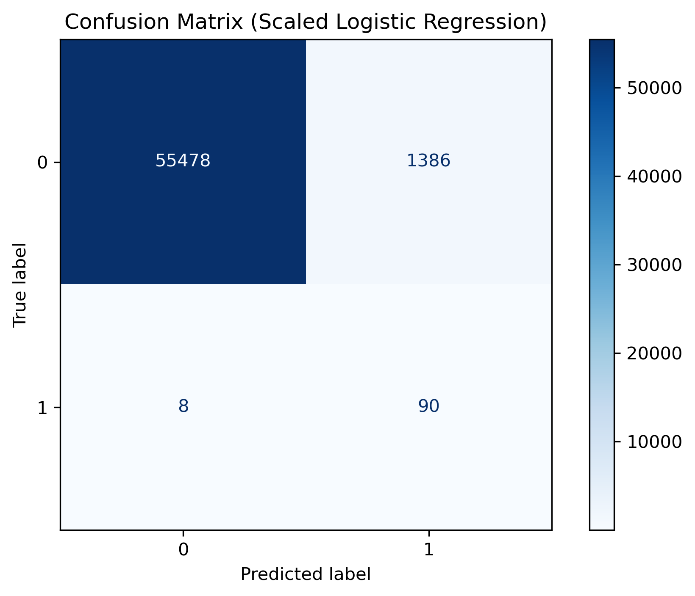
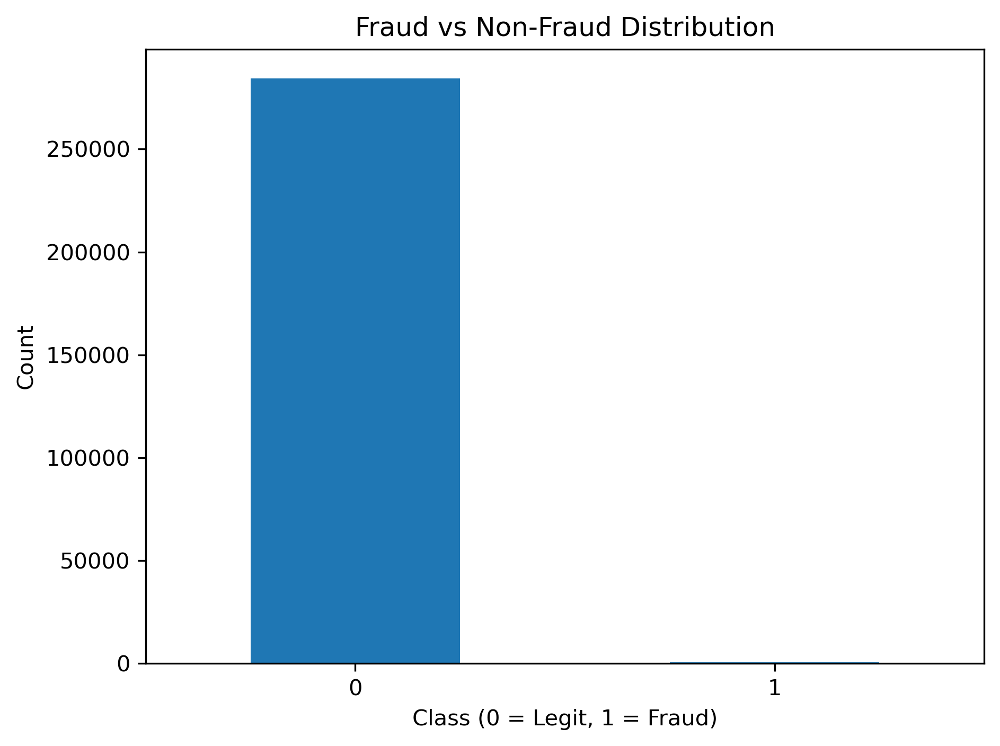

# Credit Card Fraud Detection

## 🧠 Project Overview

This project aims to detect fraudulent credit card transactions using machine learning.  
The dataset is highly imbalanced, so the focus was on improving recall without sacrificing precision.  
I implemented data preprocessing, scaling, class weighting, and threshold tuning for better fraud detection accuracy.

## 🗂️ Dataset

- **Source:** Kaggle - Credit Card Fraud Detection Dataset  
- **Size:** 284,807 transactions, 492 frauds (0.17%)  
- **Features:** Time, Amount, and 28 PCA components  

## ⚙️ Approach

1. Data cleaning and EDA to understand imbalance.  
2. Visualized class distribution (see `/visuals/class_distribution.png`).  
3. Trained Logistic Regression baseline → scaled version → threshold tuned.  
4. Evaluated with recall, precision, F1-score, and confusion matrix.  

## 📊 Results

| Metric | Baseline | Scaled | Threshold (0.3) |
|--------|-----------|--------|-----------------|
| Recall | 0.69 | 0.76 | **0.83** |
| Precision | 0.85 | 0.86 | 0.94 |

✅ Improved recall from 0.69 → 0.83 with <3% precision loss.

## 🧰 Tech Stack

- Python, Pandas, Scikit-learn, Matplotlib  
- Git, DVC for versioning  
- Jupyter Notebooks

## 📈 Visuals

  


## 🧾 Key Learnings

- How to handle imbalanced datasets effectively  
- The impact of scaling & threshold tuning on recall  
- Importance of interpretable metrics (recall > accuracy)

## 🔗 Repository Structure

``` credit-card-fraud-detection/
├── data/
│   └── creditcard.csv
├── notebooks/
│   ├── fraud_eda.ipynb
│   └── fraud_model_scaled.ipynb
├── visuals/
│   ├── class_distribution.png
│   └── confusion_matrix_scaled.png
└── README.md
 ```

## 🧑‍💻 Author

**Rahul Saini**  
[GitHub](https://github.com/RahulSaini789) | [LinkedIn](https://www.linkedin.com/in/rahul-saini-122321229/)

## 📌 Project Progress Summary

**Key Stages:**  
Baseline → Scaled Model → Threshold Tuning → Final Metrics  

🔗 [View Final Commit](https://github.com/RahulSaini789/credit-card-fraud-detection/commit/265039d05fbce91bbde5c30388d4257f35466748)
